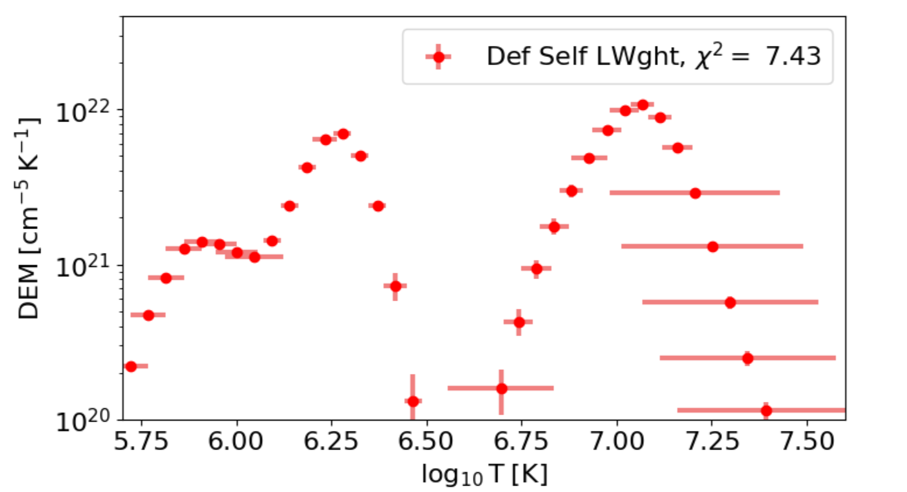

# Deriving the Differential Emission Measure (DEM) for Solar Coronal Loops

This project implements a regularized inversion method to derive the Differential Emission Measure (DEM) for a solar event, a key diagnostic tool in solar physics for understanding the temperature distribution of coronal plasma. This work was part of a research project on Solar Corona Dynamics.



## Overview

In solar physics, the plasma in the Sun's corona is optically thin, meaning we observe the integrated emission from plasma at various temperatures along the line of sight. The DEM, often denoted as ξ(T), describes the quantity of plasma as a function of temperature. Deriving the DEM from multi-wavelength observational data is a classic "inverse problem" that is often ill-posed.

This project tackles this problem by:
1.  Analyzing the hydrostatics and hydrodynamics of coronal plasma.
2.  Using a regularized inversion technique to solve for the DEM from observed data.
3.  Calculating the total Emission Measure (EM) of a solar coronal loop by integrating the resulting DEM profile.

The core of this work is based on the regularized inversion method described by **Hannah & Kontar (2013)**.

## Methodology

The observed intensity or flux, g_i, in a specific spectral channel 'i' can be related to the DEM by the following integral equation:

g_i = integral over T of [ R_i(T) * ξ(T) dT ]

where R_i(T) is the temperature response function of the instrument for that channel, and ξ(T) is the Differential Emission Measure.

To solve this ill-posed inverse problem, this project uses a regularization approach. The Jupyter Notebook `Emission_Measure_final.ipynb` implements the full pipeline:
-   It loads the necessary temperature response functions.
-   It uses a regularization matrix to find a smooth, physically plausible DEM solution.
-   It visualizes the resulting DEM profile and calculates the total Emission Measure.

## Repository Contents
-   Emission_Measure_final.ipynb: The main Jupyter Notebook containing the full analysis, code, and visualizations.
-   dn2dem_pos.py: A supplementary Python script containing functions used in the inversion process.
-   aia_tresp_en.dat: A data file containing the temperature response functions required for the analysis.


## How to Run

This project uses standard Python data science libraries.

### Prerequisites
- Python 3.x
- Jupyter Notebook or JupyterLab

### Installation
Clone the repository and install the required packages:
```bash
git clone [https://github.com/aatifh2206/Emission-Measure.git](https://github.com/aatifh2206/Emission-Measure.git)
cd Emission-Measure
pip install numpy matplotlib scipy```
jupyter notebook "Emission_Measure_final.ipynb"
